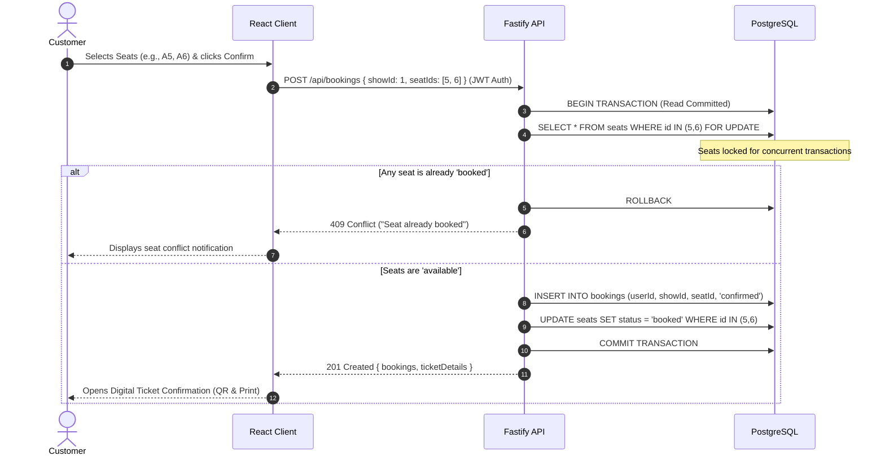
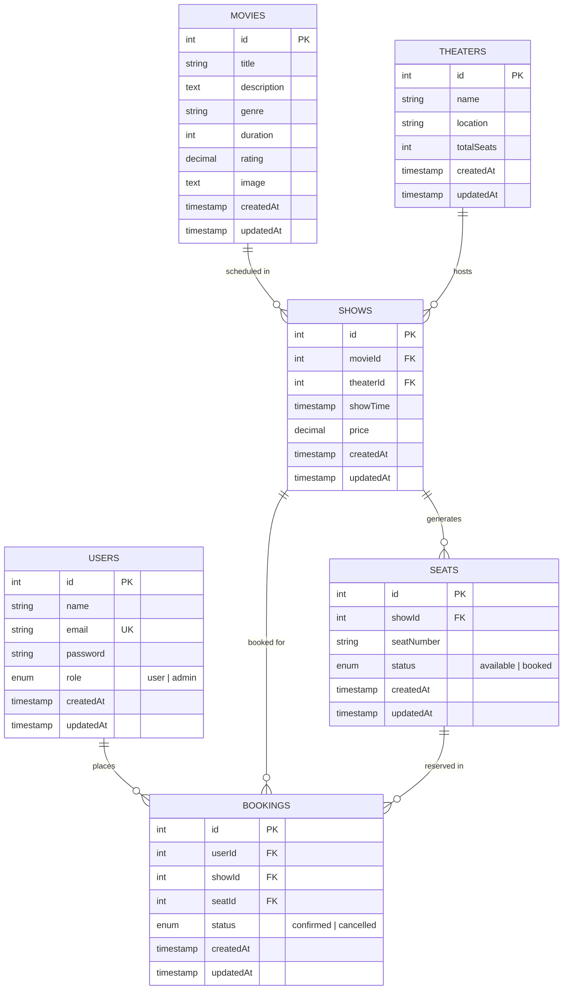

# CineBook — Movie Booking Management System
## Comprehensive Project Documentation & Coordinator Presentation Guide

---

## 1. Project Overview & Abstract

**CineBook** is an enterprise-grade, full-stack Movie Ticket Booking & Theater Management System designed to handle high-concurrency ticket reservations, dynamic theater capacity management, multi-screen showtime scheduling, and role-based administration.

### Problem Statement
In traditional and naive movie ticketing applications, high-demand booking surges often lead to:
- **Race conditions & double bookings** (two users reserving the same seat simultaneously).
- **Inconsistent seat maps** when theater configurations or capacities change.
- **Disconnected administrative workflows** where show creation fails due to missing venue configurations.

### Solution Delivered
CineBook solves these challenges by implementing:
1. **PostgreSQL Row-Level Locking (`SELECT ... FOR UPDATE`)** inside database transactions for atomic seat reservations.
2. **Automated Seat Map Synchronization (`ensureSeatsForShow`)** that guarantees complete, verified seat layouts for every scheduled show.
3. **A unified Role-Based Portal** separating customer self-service (browsing, real-time seat picking, digital e-ticketing, self-cancellations) from full administrative operations (movies, theaters, shows, and booking management).

---

## 2. Technology Stack & Technical Rationale

```
┌────────────────────────────────────────────────────────┐
│                   FRONTEND CLIENT                      │
│   React 19 • TypeScript • TanStack Router • Vite 8    │
│            TailwindCSS • Lucide Icons • Axios          │
└───────────────────────────┬────────────────────────────┘
                            │ RESTful JSON APIs (JWT)
┌───────────────────────────▼────────────────────────────┐
│                    BACKEND SERVER                      │
│       Fastify 5 (High Performance) • TypeScript        │
│          @fastify/jwt • @fastify/cors • Node.js        │
└───────────────────────────┬────────────────────────────┘
                            │ Sequelize ORM (Transactions & Locks)
┌───────────────────────────▼────────────────────────────┐
│                  DATABASE STORAGE                      │
│    PostgreSQL (Relational Schema, Foreign Keys, Indexes)│
└────────────────────────────────────────────────────────┘
```

| Layer | Technology | Rationale |
| :--- | :--- | :--- |
| **Frontend Framework** | **React 19 + TypeScript** | Component-based reactivity, strong type safety, and fast DOM rendering. |
| **Routing** | **TanStack React Router** | Type-safe declarative routing with parameterized paths (`/movies/$movieId`, `/seats/$showId`, `/booking/$bookingId`). |
| **Styling & UI** | **TailwindCSS** | Modern dark-mode aesthetic with glassmorphism, responsive grid layouts, and micro-animations. |
| **Backend Runtime** | **Fastify 5 + TypeScript** | Up to 2x faster throughput than Express.js with low overhead, schema validation, and native async support. |
| **ORM & Data Access**| **Sequelize 6** | Structured relational modeling, transaction management, connection pooling, and explicit query locking. |
| **Database** | **PostgreSQL** | ACID-compliant relational storage, row-level locking, foreign key constraints, and multi-version concurrency control (MVCC). |
| **Authentication** | **JWT (JSON Web Tokens)** | Stateless token-based authentication with role claims (`admin` vs. `user`). |

---

## 3. System Architecture & Concurrency Control

### 3.1 Architecture Data Flow



### 3.2 Key Concurrency Safeguard: PostgreSQL Row Lock
- When multiple users attempt to checkout the same seat concurrently, naive applications encounter a **Read-Check-Write race condition**.
- CineBook resolves this by executing `SELECT ... FOR UPDATE` inside a Sequelize transaction. The first request acquires an exclusive row lock on the selected seat rows; subsequent concurrent requests are held until the transaction finishes and immediately receive a `409 Conflict` response upon detecting the updated status.

---

## 4. Entity-Relationship (ER) Data Model



---

## 5. Functional Modules Breakdown

### 5.1 Customer Experience Module
1. **Landing & Discovery (`/`)**:
   - Hero banner featuring trending cinema picks loaded dynamically from PostgreSQL.
   - Quick search input and featured movie grid.
2. **Movie Catalog & Filtering (`/movies`)**:
   - Live search by title, genre, or synopsis keywords.
   - Dynamic genre chips (Action, Sci-Fi, Drama, Animation, etc.) generated from database records.
   - Sorting by *Latest Added*, *Top Rated*, *Duration*, and *Title*.
3. **Movie Details & Showtimes (`/movies/:movieId`)**:
   - High-resolution poster, synopsis, duration, rating, and genre tags.
   - Screenings grouped by venue, date, time, and ticket pricing.
4. **Interactive Seat Selection (`/seats/:showId`)**:
   - Visual curved theater screen simulation with glow effects.
   - Grid layout organizing seats into rows (A, B, C...).
   - Real-time seat status indicators: Available (clickable), Selected (violet highlighted), Booked (disabled).
   - Atomic multi-seat cart calculation with price summary.
5. **Digital E-Ticket Confirmation (`/booking/:bookingId`)**:
   - Printable cinema ticket layout with perforated tear design.
   - Unique Booking Reference ID (`BK-{id}`) and QR code visual accent.
   - One-click native **Print Ticket** action (`window.print()`).
6. **My Bookings & Self-Service Cancellation (`/my-bookings`)**:
   - List of all user bookings with date, showtime, venue, seat, and price.
   - One-click **Cancel Ticket** button that updates booking status to `cancelled` and immediately unlocks the seat for other customers.

### 5.2 Administrative Operations Module
1. **Admin Dashboard (`/admin`)**:
   - High-level metric counters: Total Users, Total Movies, Total Theaters, Scheduled Shows.
   - Real-time performance analytics: Confirmed Bookings, Gross Revenue (₹), Seat Utilization.
   - Quick-action shortcuts to manage system entities.
2. **Movie Management (`/admin/movies`)**:
   - Create, edit, and delete movie records.
   - Form validation for title, genre, duration in minutes, rating (0–10), and poster URLs.
3. **Theater Management (`/admin/theaters`)**:
   - Venue configuration (Name, Location, Total Seat Capacity).
   - Supports editing capacities which automatically adjust show seat generation.
4. **Show Scheduling & Seat Generator (`/admin/shows`)**:
   - Schedule showtimes by selecting Movie, Theater, Date, Time, and Price.
   - Automatic seat layout creation upon show creation.
   - Manual **Create Seats** action with idempotent repair logic.
5. **Bookings Oversight (`/admin/bookings`)**:
   - Live search by customer name, email, movie title, theater, or booking ID.
   - Filter by status (`All`, `Confirmed`, `Cancelled`).
   - Admin override actions: Cancel booking (releases seat) or Delete booking record.
6. **Shared Subnavigation (`AdminNav`)**:
   - Integrated tab bar providing instant navigation across all admin views.

---

## 6. REST API Reference

### 6.1 Authentication (`/api/auth`)
| Method | Endpoint | Access | Description |
| :--- | :--- | :--- | :--- |
| `POST` | `/api/auth/register` | Public | Register new user account (`name`, `email`, `password`) |
| `POST` | `/api/auth/login` | Public | Authenticate user & return signed JWT token |

### 6.2 Movies (`/api/movies`)
| Method | Endpoint | Access | Description |
| :--- | :--- | :--- | :--- |
| `GET` | `/api/movies` | Public | Get all active movies |
| `GET` | `/api/movies/:id` | Public | Get movie details by ID |
| `POST` | `/api/movies` | Admin | Create a new movie |
| `PUT` | `/api/movies/:id` | Admin | Update existing movie |
| `DELETE` | `/api/movies/:id` | Admin | Delete movie record |

### 6.3 Theaters (`/api/theaters`)
| Method | Endpoint | Access | Description |
| :--- | :--- | :--- | :--- |
| `GET` | `/api/theaters` | Public | Get all theaters |
| `GET` | `/api/theaters/:id` | Public | Get theater by ID |
| `POST` | `/api/theaters` | Admin | Create theater with capacity |
| `PUT` | `/api/theaters/:id` | Admin | Update theater details |
| `DELETE` | `/api/theaters/:id` | Admin | Delete theater |

### 6.4 Shows & Seats (`/api/shows`, `/api/seats`)
| Method | Endpoint | Access | Description |
| :--- | :--- | :--- | :--- |
| `GET` | `/api/shows` | Public | Get all scheduled shows |
| `GET` | `/api/shows/movie/:movieId` | Public | Get shows for a specific movie |
| `GET` | `/api/shows/:id` | Public | Get show details with theater & movie |
| `POST` | `/api/shows` | Admin | Create show + auto-generate seats |
| `PUT` | `/api/shows/:id` | Admin | Update show time or pricing |
| `DELETE` | `/api/shows/:id` | Admin | Delete show (blocked if bookings exist) |
| `GET` | `/api/seats/show/:showId` | User | Get seat map & availability for a show |
| `POST` | `/api/seats/show/:showId` | Admin | Idempotent seat creation/repair |

### 6.5 Bookings (`/api/bookings`)
| Method | Endpoint | Access | Description |
| :--- | :--- | :--- | :--- |
| `POST` | `/api/bookings` | User | Book 1 or more seats with row locking |
| `GET` | `/api/bookings/my` | User | Get logged-in user's booking history |
| `GET` | `/api/bookings/:id` | User | Get digital ticket details by booking ID |
| `DELETE` | `/api/bookings/:id` | User | Cancel own booking & release seat |
| `GET` | `/api/bookings/all` | Admin | Get all bookings across all users |
| `GET` | `/api/bookings/admin/dashboard` | Admin | Aggregate dashboard metrics & revenue |
| `PATCH` | `/api/bookings/admin/:id/cancel` | Admin | Admin cancel booking (releases seat) |
| `DELETE` | `/api/bookings/admin/:id` | Admin | Admin delete booking record |

---

## 7. Presentation Script & Demonstration Walkthrough

When presenting to your project coordinator, follow this structured 5-step demonstration:

### Step 1: System Introduction & Technology Overview
> *"Good morning/afternoon. Today I am presenting CineBook, a high-concurrency Movie Booking and Cinema Management System. It is built using Fastify 5 and PostgreSQL on the backend with Sequelize ORM, and React 19 with TanStack Router and TailwindCSS on the frontend."*

### Step 2: Database Initialization & Seeding
> *"The backend includes an automated database seeder (`npm run seed`) that populates our relational PostgreSQL database with verified admin and customer accounts, multiple theater venues, blockbuster movies, and scheduled shows with automatically generated seat layouts."*

### Step 3: Administrative Control Tour
1. Log in as `admin@cinebook.com` / `Admin@123`.
2. Open **Admin Dashboard** (`/admin`): Point out the live user count, theater count, confirmed bookings, and calculated gross revenue.
3. Open **Manage Movies** (`/admin/movies`): Demonstrate editing or adding a movie with duration and rating validation.
4. Open **Manage Theaters** (`/admin/theaters`): Show venue capacity configuration.
5. Open **Manage Shows** (`/admin/shows`): Highlight how creating a show automatically configures its seat map.
6. Open **Manage Bookings** (`/admin/bookings`): Demonstrate searching bookings by customer email or movie name, status filters, and admin cancellation controls.

### Step 4: Customer Booking & Interactive Seat Selection
1. Log out or sign in as `user@cinebook.com` / `User@123`.
2. Open **Movies Catalog** (`/movies`): Demonstrate live search, genre filtering chips, and sorting.
3. Open **Movie Details** (`/movies/:id`): Select an upcoming showtime.
4. Open **Seat Selection** (`/seats/:id`): Select multiple available seats (e.g., A3, A4). Note the real-time subtotal calculation.
5. Click **Confirm Booking**:
   - Highlight the **E-Ticket Confirmation Page** with digital ticket ID (`BK-{id}`), QR accent, and the **Print Ticket** action.

### Step 5: Transactional Integrity & Seat Cancellation
1. Open **My Bookings** (`/my-bookings`): Show the newly confirmed ticket.
2. Return to the same show's seat map: Prove that seats A3 and A4 are now disabled and marked as **Booked**.
3. Return to **My Bookings** and click **Cancel Booking**:
   - Explain that the transaction updates the booking to `cancelled` and atomically sets the seat status back to `available`.
4. Re-open the seat map to prove the seat is now immediately bookable again.

---

## 8. Summary of Technical Achievements

| Technical Requirement | Implementation in CineBook |
| :--- | :--- |
| **Concurrency Protection** | PostgreSQL Row-Level Lock (`SELECT ... FOR UPDATE`) in `createBooking` prevents race conditions. |
| **Data Integrity** | Foreign key cascades, unique constraints on `(showId, seatNumber)`, and ACID transactions. |
| **Dynamic Seat Generation** | Automatic calculation from theater capacity (`ensureSeatsForShow`) ensuring zero missing seats. |
| **Type Safety** | End-to-end TypeScript interfaces spanning models, controllers, and React components. |
| **Production Readiness** | Fastify 5 architecture, Vite bundling in 1.3s, responsive mobile design, and automated seeding. |

---

## 9. Quick Start Commands

```bash
# 1. Start Backend Server
cd backend
npm install
npm run seed     # One-time database initialization
npm run dev      # Server on http://localhost:5050

# 2. Start Frontend Client
cd frontend
npm install
npm run dev      # Client on http://localhost:5173
```
